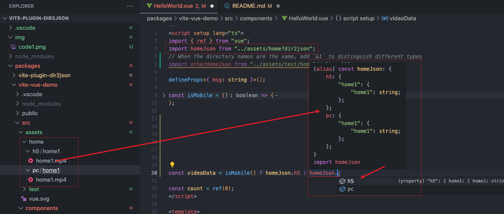
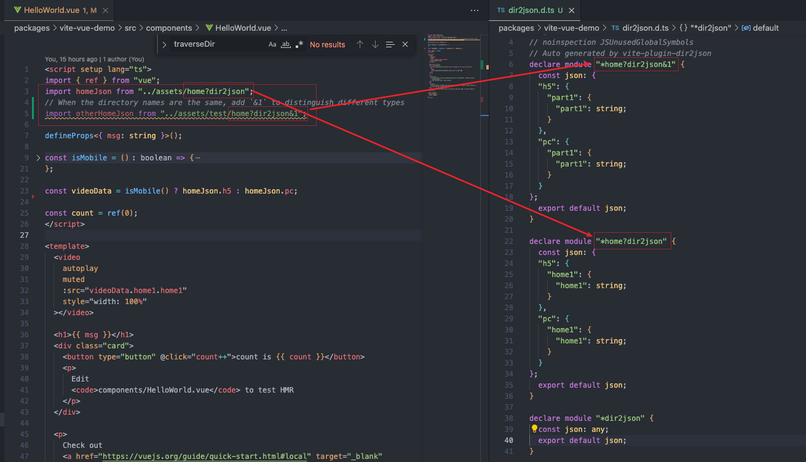
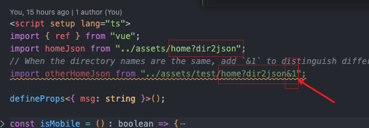
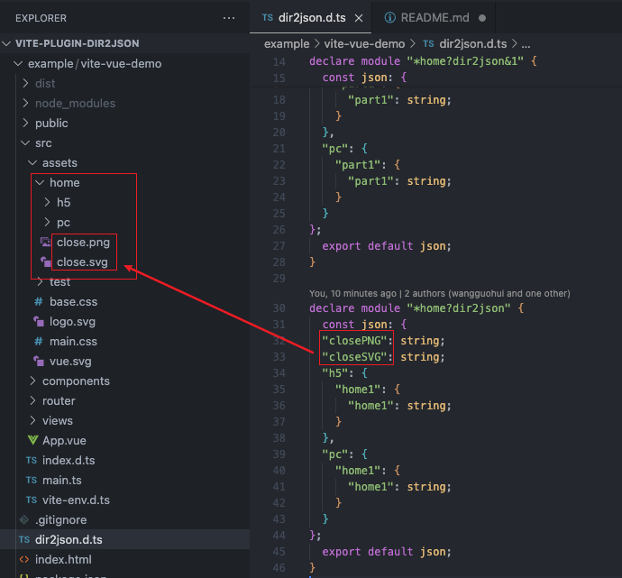

[简体中文](./README_zh.md)

# Vite Plugin Dir2json


# Feature

- [x] Convert the directory structure into json data containing specific file paths.
- [x] By default, a static path is returned, and dynamic import can be returned by specifying a `lazy` query.

```js
import homeJson from "/path/to/home?dir2json&lazy";
```

- [x] Support custom file format filtering through query or options, `ext` and `extg`query will override the default supported ext list.

```js
import homeJson from "/path/to/home?dir2json&ext=.vue,.ts&lazy";
// Or there are too many customized file suffixes. You can configure the format group through `options.extGroup` and then specify it through `extg` query.
import homeJson from "/path/to/home?dir2json&extg=a&lazy";

// vite.config.ts
dir2json({
  extGroup: {
    a: [".vue", ".ts"],
  },
});
```

For example, for this structure of directory:

```bash
home
├── h5
│   └── home1
│       └── home1.mp4
└── pc
    └── home1
        └── home1.mp4
```

you can get this result:

```ts
import homeJson from "/path/to/home?dir2json";

console.log(homeJson);
// {
//   h5: {
//     home1: {
//       home1: "/src/assets/home/h5/home1/home1.mp4",
//     },
//   },
//   pc: {
//     home1: {
//       home1: "/src/assets/home/pc/home1/home1.mp4",
//     },
//   },
// };
```

Here are the file extensions supported by default, you can specify other extensions using the `ext` query or `extg` query with `options.extGroup`

```ts
const supportImageExt = [
  ".apng",
  ".png",
  ".jpg",
  ".jpeg",
  ".jfig",
  ".pjepg",
  ".pjp",
  ".gif",
  ".svg",
  ".ico",
  ".avif",
];
const supportMediaExt = [
  ".mp4",
  ".webm",
  ".ogg",
  ".mp3",
  ".wav",
  ".flac",
  ".aac",
  ".opus",
  ".mov",
];
```

# How to use

## Install

```bash
# using npm
npm install -D vite-plugin-dir2json
# using pnpm
pnpm install -D vite-plugin-dir2json
# using yarn
yarn add --dev vite-plugin-dir2json
```

## Vite config

```js
import { defineConfig } from "vite";
import dir2json from "vite-plugin-dir2json";

// https://vitejs.dev/config/
export default defineConfig({
  // ...
  plugins: [dir2json(/* options */)],
});
```

## Options

```ts
interface Dir2jsonOptions {
  /**
   * Additional support for file extensions, use the key as `extg` query
   */
  extGroup?: { [key: string]: string[] };
  /**
   * Filepath to generate corresponding .d.ts file.
   * Defaults to './dir2json.d.ts' when `typescript` is installed locally.
   * Set `false` to disable.
   */
  dts?: boolean | string;
  // /**
  //  * @deprecated (<=v1.0.5) use 'ext' query or 'extg' query with 'option.extGroup'
  //  * Additional support for file extensions
  //  */
  // ext?: string[];
}
```

## Query

- `ext`: specify other extensions, eg: `xx?dir2json&ext=.vue`
- `extg`: specify other extensions with `options.extGroup`, eg:

```ts
// vite.config.ts
// ...
export default defineConfig({
  // ...
  plugins: [
    dir2json({
      extGroup: {
        a: [".vue", ".xxx", ".xxx", ".xxxx"],
      },
    }),
  ],
});

// use
import xxxJson from "/path/to/xxx?dir2json&extg=a";
```

- `lazy`: specify return dynamic import，eg:

```ts
// router.ts
import Views from "/path/to/views?dir2json&ext=.vue&lazy";

console.log(Views);
// {
//   about: () => import('/path/to/views/about.vue')
// };
```

## With typescript

When your project is a ts project, `vite-plugin-dir2json` will turn on ts support by default, and the `dir2json.d.ts` file will be automatically generated in the local development environment, allowing you to get the correct type prompts, as follows:



In order to properly hint types for import-dir2json variable：

1. Enable options.dts so that `dir2json.d.ts` file is automatically generated
2. Make sure `dir2json.d.ts`'s path is include in tsconfig.json, as follows:

```json
// tsconfig.json
{
  // ...
  "include": ["./dir2json.d.ts" /** ... */]
  // ...
}
```

3. run dev server(`npm run dev`), save the changes after add `imort xx from xxx?dir2json`, then the `dir2json.d.ts` file will be updated

### Notice

1. The automatically generated `dir2json.d.ts` looks like this:



As you can see, the last-level directory name and query parameter will be used as the module name, so when the last-level directory name is the same, in order to prevent type declaration overwriting, you can add the query parameter to ensure that the module name is unique, as follows `&1` :



2. By default, the returned json object key does not have file suffix information, but when there are files with the same name and different suffixes that meet the requirements in the same directory, in order to distinguish these files, the keys corresponding to these files will be spelled with suffix information, as follows:



# [Example](./example/vite-vue-demo/vite.config.ts)

```ts
import dirJson from "../path/to/dir?dir2json";

console.log("dirJson>>>", dirJson);
```
